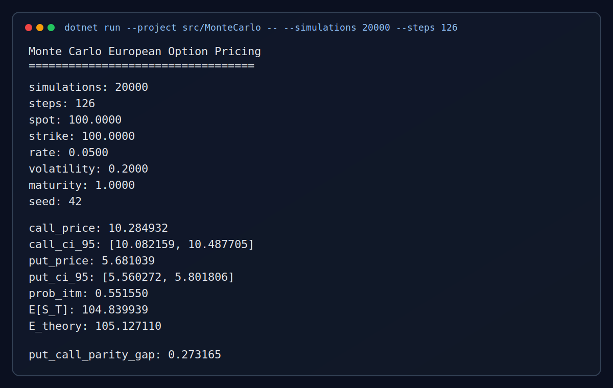

# Monte-Carlo

A fresh .NET implementation of Monte Carlo simulation for European option pricing.

## Sample Result



Generated with:

```bash
dotnet run --project src/MonteCarlo -- --simulations 20000 --steps 126
```

## What it does

- Simulates geometric Brownian motion price paths
- Prices European call and put options
- Reports 95% confidence intervals
- Shows in-the-money probability and expected terminal price
- Supports deterministic runs with an explicit RNG seed
- Offers text and JSON output modes

## Requirements

- .NET SDK 9+

## Quickstart

```bash
dotnet run --project src/MonteCarlo --
```

With custom parameters:

```bash
dotnet run --project src/MonteCarlo -- --simulations 300000 --steps 365 --spot 120 --strike 130 --rate 0.04 --volatility 0.25 --maturity 1.5
```

JSON output:

```bash
dotnet run --project src/MonteCarlo -- --json --simulations 200000
```

## CLI options

```text
--simulations <n>   Number of Monte Carlo paths (default: 100000)
--steps <n>         Time steps per path (default: 252)
--spot <x>          Initial asset price (default: 100.0)
--strike <x>        Option strike price (default: 100.0)
--rate <x>          Risk-free annual rate as decimal (default: 0.05)
--volatility <x>    Annual volatility as decimal (default: 0.20)
--maturity <x>      Time to maturity in years (default: 1.0)
--seed <n>          RNG seed for deterministic runs (default: 42)
--json              Print machine-readable JSON
```

## Test

```bash
dotnet test
```
